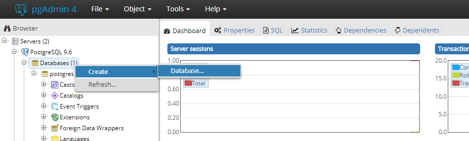
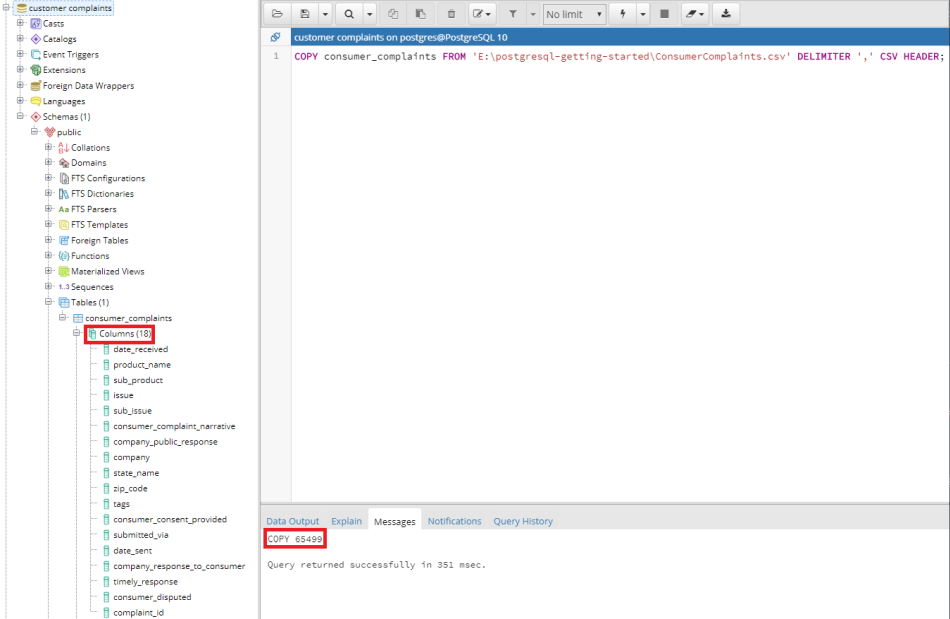
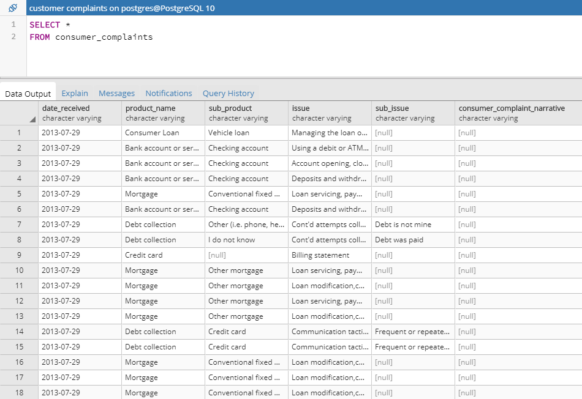
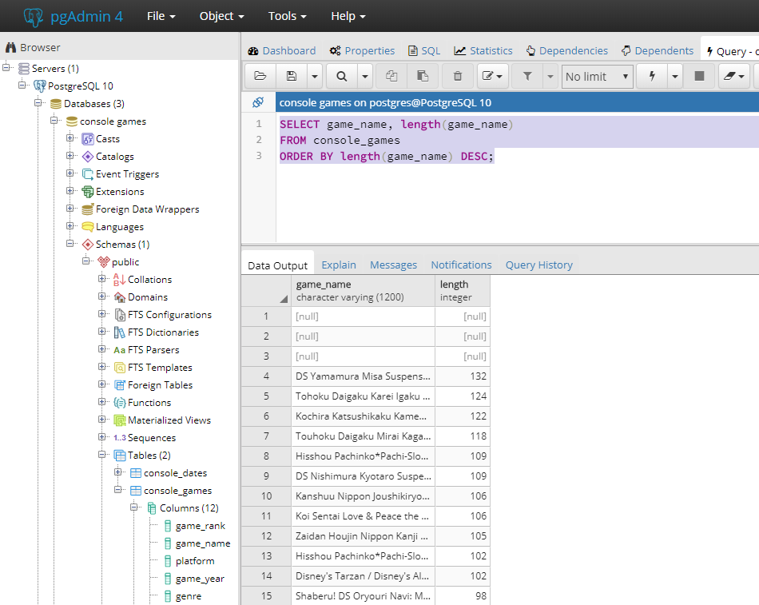
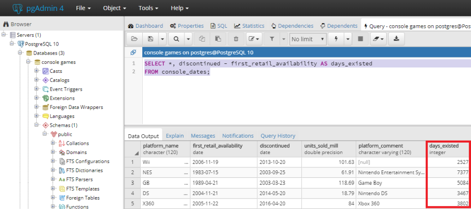
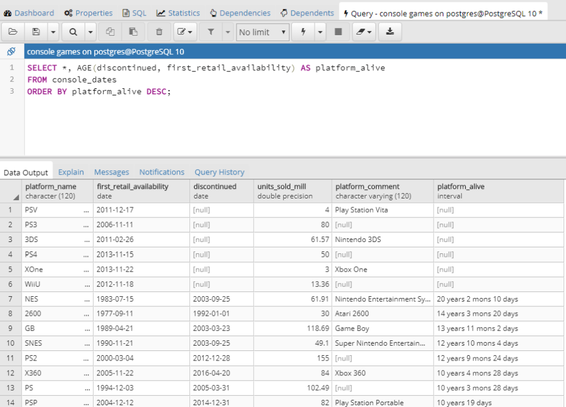
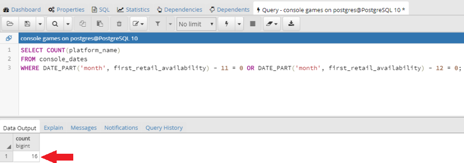
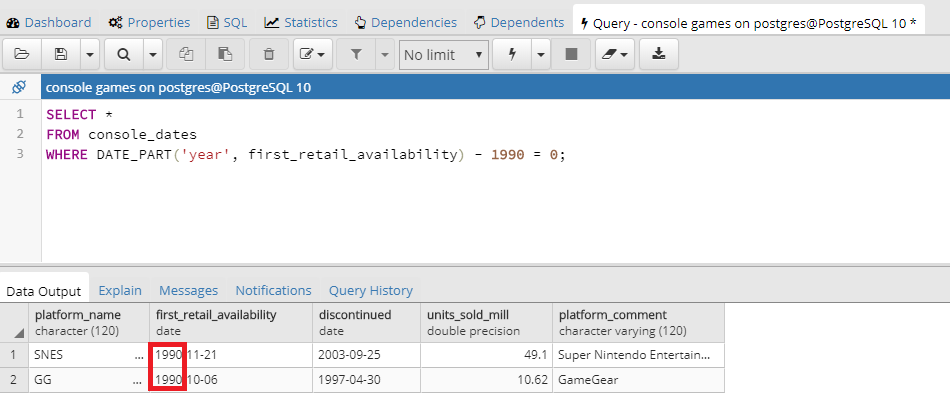

# Getting started with PostgreSQL in Windows 10

<!-- TOC -->

- [Getting started with PostgreSQL in Windows 10](#getting-started-with-postgresql-in-windows-10)
  - [Installation](#installation)
  - [Adding some Dummy Data to work with](#adding-some-dummy-data-to-work-with)
    - [SELECT Queries](#select-queries)
      - [ORDER BY](#order-by)
      - [WHERE](#where)
      - [OR](#or)
      - [AND](#and)
      - [LIKE & LOWER](#like--lower)
      - [LIKE & UPPER](#like--upper)
      - [Working with numbers](#working-with-numbers)
  - [Adding a another Dataset](#adding-a-another-dataset)
    - [ALTER TABLE & ADD COLUMN](#alter-table--add-column)
    - [UPDATE & SET](#update--set)
    - [VARCHARS](#varchars)
      - [length](#length)
      - [left & right](#left--right)
      - [reverse](#reverse)
    - [Working with Dates](#working-with-dates)
      - [AS](#as)
      - [AGE](#age)
      - [DATE_PART & COUNT](#date_part--count)
    - [Changing the Data Type](#changing-the-data-type)
      - [CAST](#cast)
        - [to_date](#to_date)
    - [IS null](#is-null)

<!-- /TOC -->

## Installation

[Download the Version](https://www.postgresql.org/download/) of PostgreSQL that suits your OS. In my case I will choose the installer certified by EnterpriseDB for Windows 64bit.


Start the installer and accept the defaults - only add __your own password__ that you will be able to use with the __username: postgres__ to log in to the pgAdmin Control Panel.


## Adding some Dummy Data to work with

We are going to use the free available [Consumer Complaint Database](https://www.consumerfinance.gov/data-research/consumer-complaints/) from the Consumer Financial Protection Bureau.

Start the __pgAdmin4__ Admin Panel and right-click __Databases__ to create a new db. Give it a name, e.g. `consumer complaints`:





Now right-click the newly created Database and selct the __Query Tool__. Paste the following in and click on __Execute__ to create the `consumer_complaint` table:

```sql
CREATE TABLE consumer_complaints (
    date_received varchar,
    product_name varchar,
    sub_product varchar,
    issue varchar,
    sub_issue varchar,
    consumer_complaint_narrative varchar,
    company_public_response varchar,
    company varchar,
    state_name varchar,
    zip_code varchar,
    tags varchar,
    consumer_consent_provided varchar,
    submitted_via varchar,
    date_sent varchar,
    company_response_to_consumer varchar,
    timely_response varchar,
    consumer_disputed varchar,
    complaint_id integer
);
```

> Note: If you are running the Astrill VPN client on your System, this will block access to the Query Tool. Add pgAdmin4 to the list of allowed programs that are not forced through the VPN tunnel.


Now we can add the data from the earlier downloaded _ConsumerComplaints.csv_ file, by executing the following query (change the path-to-file according to your download folder)


```sql
COPY consumer_complaints FROM 'E:\postgresql-getting-started\ConsumerComplaints.csv' DELIMITER ',' CSV HEADER;
```





We have now created our schema with 18 columns and copied 65499 data entries from the CSV file into our table. We can check our data by running the following query:


```sql
SELECT *
FROM consumer_complaints;
```


### SELECT Queries

The `SELECT *` allows you to grab the content of _all columns_ of your table. If you want to select specific columns you can string them together, separated by commas - e.g. `SELECT date_received, issue, state_name, tags`.





#### ORDER BY

```sql
SELECT *
FROM consumer_complaints
ORDER BY company;
```

```sql
SELECT *
FROM consumer_complaints
ORDER BY zip_code ASC;
```

```sql
SELECT *
FROM consumer_complaints
ORDER BY zip_code, date_received DESC;
```

#### WHERE

To Filter your results, by adding a condition with the __Where__ statement:

```sql
SELECT product_name, issue
FROM consumer_complaints
WHERE state_name = 'NY';
```

This query only displays results from the two selected columns inside the referenced table where the _state_name_ equals New York. We can also add some logic to our queries - e.g. if we want to know how many complaints weren't answered on the same day we can write the following SQL query:


```sql
SELECT company, product_name, issue
FROM consumer_complaints
WHERE date_sent != date_received;
```

#### OR

```sql
SELECT company, product_name, issue
FROM consumer_complaints
WHERE state_name = 'NY' OR state_name = 'CA';
```

#### AND

```sql
SELECT company, product_name
FROM consumer_complaints
WHERE tags = 'Servicemember' AND timely_response = 'Yes';
```


#### LIKE & LOWER

```sql
SELECT product_name
FROM consumer_complaints
WHERE LOWER(product_name) LIKE '%credit%';
```

The __LIKE__ condition allows us to use %-wildcards to search for every value of _product\_name_ that contains the word _credit_. The Select query is case sensitive - by adding __LOWER__ we transform all _product\_name_ values to lower-case and then compare it against a lower-case search query. The same can be achieved with using __UPPER__ instead:


#### LIKE & UPPER

```sql
SELECT company
FROM consumer_complaints
WHERE UPPER(issue) LIKE '%LATE%';
```

#### Working with numbers

Display all companies that are in an area that zip-code starts with `12*`:

```sql
SELECT company, product_name
FROM consumer_complaints
WHERE zip_code LIKE '12___';
```

 All zip-codes have 5 digits - we signify the position of our search number by adding underscore for every digit that is a wildcard - e.g. `__1__` would hit all zip-codes that have a 1 in the middle. Alternatively, you can also use the `%` syntax to get the same result:


```sql
SELECT company, product_name
FROM consumer_complaints
WHERE zip_code LIKE '12%';
```


Using `%1%` instead would give you all the zip-codes that have a number 1 in __any position__.


__COUNT__

```sql
SELECT COUNT(company)
FROM consumer_complaints
WHERE LOWER(company) LIKE '%bell%';
```

Count all instances where a company with the word _bell_ in its name filed a complaint.


## Adding a another Dataset

The .csv files used here can be downloaded from here ([Section 5](https://www.superdatascience.com/sql/)). Right-click __Databases__ to add a new db and name it `console games`. Then create the following tables with the 2 .csv files you just downloaded:

```sql
CREATE TABLE console_games (
    game_rank integer,
    game_name varchar(1200),
    platform varchar(1200),
    game_year integer,
    genre varchar(20),
    publisher varchar(1200),
    na_sales float8,
    eu_sales float8,
    jp_sales float8,
    other_sales float8
);

COPY console_games FROM 'E:\postgresql-getting-started\ConsoleGames.csv' DELIMITER ',' CSV HEADER;
```

and

```sql
CREATE TABLE console_dates (
    platform_name char(120),
    first_retail_availability date,
    discontinued date,
    units_sold_mill float8,
    platform_comment varchar(120)    
);

COPY console_dates FROM 'E:\postgresql-getting-started\ConsoleDates.csv' DELIMITER ',' CSV HEADER;
```

Lets work with our data and add all NA, EU and JP sales together to get a new colum with `global_sales`:

### ALTER TABLE & ADD COLUMN

```sql
ALTER TABLE console_games
ADD COLUMN global_sales float8;
```

This will alternate the table _console\_games_  and add a column named _global\_sales_ that will receive a number with decimal point. We can now fill in the value by a simple addition:

### UPDATE & SET

```sql
UPDATE console_games
SET global_sales = na_sales + eu_sales + jp_sales;
```

Now we can calculate the percentage of the North-American sales from the global sales:

```sql
ALTER TABLE console_games
ADD COLUMN na_sales_percent float8;

UPDATE console_games
SET na_sales_percent = na_sales / global_sales * 100
WHERE global_sales > 0;
```

### VARCHARS

Working with __String Functions__

#### length

```sql
SELECT game_name, length(game_name)
FROM console_games
ORDER BY length(game_name) DESC;
```

Will give us a column with the count of characters inside the name of the game:




#### left & right

To only grab the first 4 letters of the publisher name:

```sql
SELECT left(publisher, 4)
FROM console_games
ORDER BY left(publisher, 1) DESC;
```

#### reverse

Will reverse the order of the characters or numbers of the values of the selected column:

```sql
SELECT reverse(genre)
FROM console_games;
```

### Working with Dates

#### AS

```sql
SELECT *, discontinued - first_retail_availability AS days_existed
FROM console_dates;
```

__AS__ will create a __temporary column__ (we need to use ALTER TABLE add it permanently) with the number of days a console system was available on the market:





This can help you to get a quick overview over your data - but isn't very precise e.g.:


```sql
SELECT *, (discontinued - first_retail_availability)/365 AS years_existed
FROM console_dates
ORDER BY years_existed DESC;
```


#### AGE

The more accurate way to calculate it:

```sql
SELECT *, AGE(discontinued, first_retail_availability) AS platform_alive
FROM console_dates
ORDER BY platform_alive DESC;
```





#### DATE_PART & COUNT

The PostgreSQL DATE_PART() function, that allows you to retrieve subfields e.g., year, month, week from a date or time value. E.g. DATE_PART(month) will only subtract the subfield month of a date - you have one date in November and the second in December this will be `11 - 12 = -1`. One use case of this function is to check how many entries are from a specific month of the year:

```sql
SELECT COUNT(platform_name)
FROM console_dates
WHERE DATE_PART('month', first_retail_availability) - 11 = 0 OR DATE_PART('month', first_retail_availability) - 12 = 0;
```

This query will __COUNT__ all the console systems that were released in November __OR__ December - just in time for the X-mas present madness.





Or you can check what consoles where released in a specific year:


```sql
SELECT *
FROM console_dates
WHERE DATE_PART('year', first_retail_availability) - 1990 = 0;
```





The values of the field must be in a list of permitted values mentioned below:

* century
* decade
* year
* month
* day
* hour
* minute
* second
* microseconds
* milliseconds
* dow
* doy
* epoch
* isodow
* isoyear
* timezone
* timezone_hour
* timezone_minute


### Changing the Data Type

#### CAST

```sql
SELECT CAST(game_year as varchar(4))
FROM console_games
ORDER BY game_year;
```

A shortcut is that will do the same:

```sql
SELECT game_year::varchar(4)
FROM console_games
ORDER BY game_year;
```

##### to_date

More useful is the conversion to a date data type:

```sql
SELECT to_date(CAST(game_year as varchar(4)), 'yyyy')
FROM console_games
ORDER BY game_year;
```


### IS null

Finding undefined fields (notice: we have to use __IS__ instead of an equal sign when working with _null_ :

```sql
SELECT *
FROM console_games
WHERE game_name IS NULL;
```

Adding a value to an undefined field:

```sql
UPDATE console_games
SET jp_sales = round((na_sales + eu_sales + other_sales) / 3)
WHERE jp_sales IS null;
```